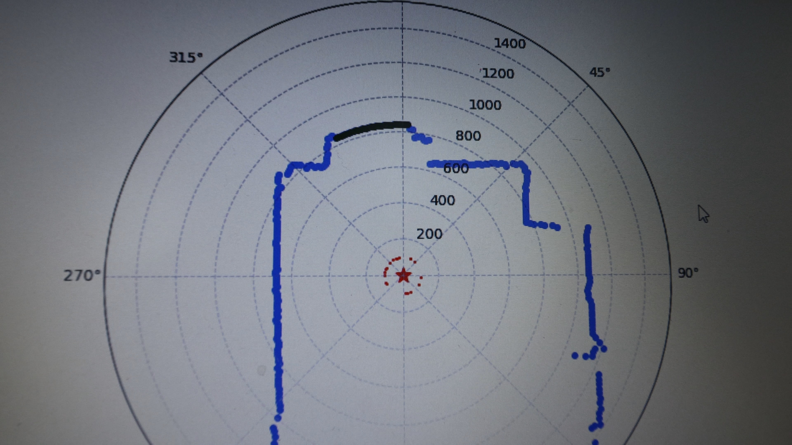
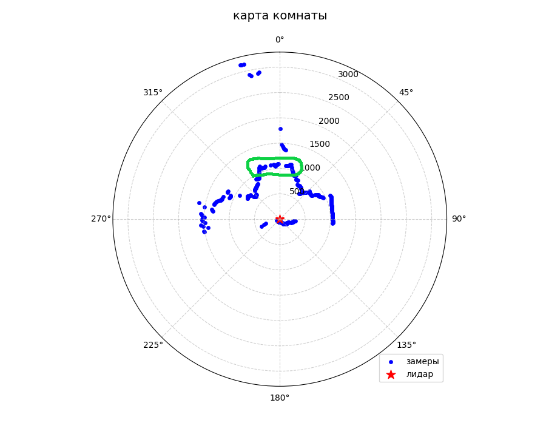
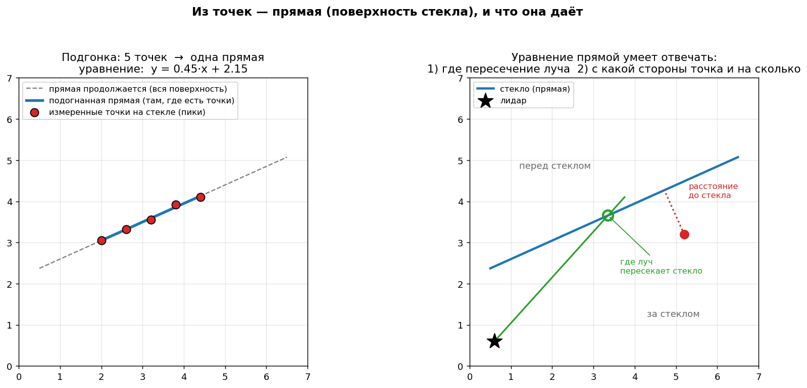
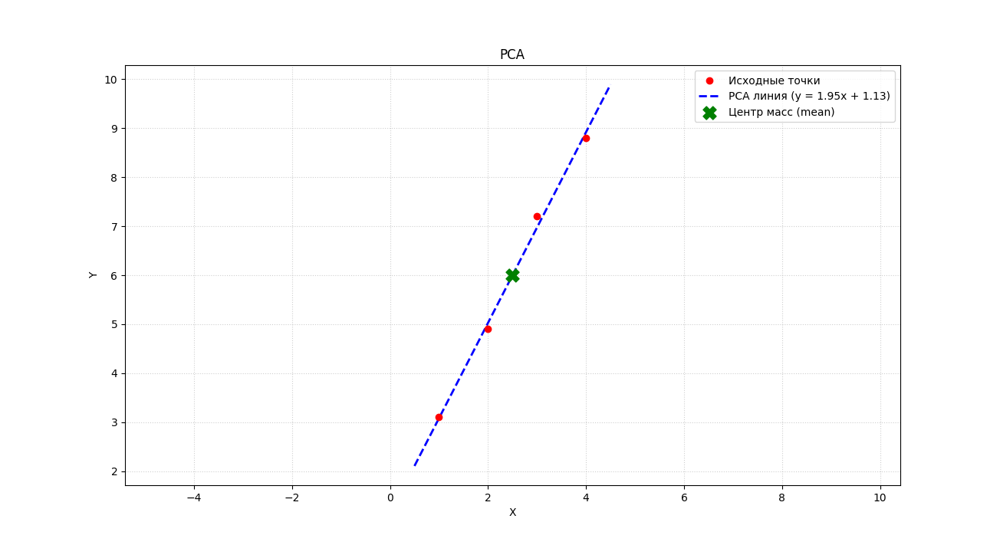

# lidar_filter



Фильтр для 2D лидара (RPLIDAR C1), который находит стёкла и зеркала в скане и убирает искажения, которые они вносят в карту.

Проблема в том, что обычный лидар не видит стекло как препятствие: часть лучей проходит насквозь и видит то, что за стеклом, часть отражается как от стены. Для occupancy grid карты это плохо — на месте стекла образуется дыра, через которую робот попытается проехать.

Вот как скан выглядит на практике:  



Зеленым в paint'e я нарисовал, где на самом деле находится стекло. Это стекло - дверь на балкон, как видно сильно утопленная в стену. Это единственное стекло в моем доме, за которым есть объекты (за окнами дома на расстоянии 30-40 метров).

---

## Обзор исследований

Перед тем как писать свой фильтр, разобрал два открытых исследования и один закрытый проект с открытым кодом. Ниже конспект каждого — что предлагают, какая математика внутри, и почему само по себе не подошло.

### [Tibebu et al., 2021 — LiDAR-Based Glass Detection for Improved Occupancy Grid Mapping](https://www.mdpi.com/1424-8220/21/7/2263)

Метод целиком одно-скановый, без накопления по кадрам. Три шага.

**Фильтр 1.** Скользящее окно по дальности, окно из `H` точек до и `J` точек после текущего луча. Внутри окна считается стандартное отклонение (STDV):

```
σ = sqrt( (1/N) * Σ (L_r - L̄)² )
```

где `L_r` — дальности внутри окна, `L̄` — их среднее, `N` — число валидных (не дропаут) точек в окне. Порог `Trh` калибруется вручную по размеченным данным:

```
Trh = ½ * (σ_PCoG + σ_PCoO)
```

`σ_PCoG` — среднее STDV на заведомо стеклянных точках, `σ_PCoO` — на заведомо обычных объектах. Если `σ > Trh` — луч кандидат в стекло (PCoG), иначе объект (PCoO).

**Фильтр 2.** Уточнение границ. Начало стеклянного участка — там, где дальность растёт, а интенсивность одновременно падает. Конец — где дальность падает, а интенсивность растёт. Всё, что попало между этими границами, подтверждается как стекло, что снаружи — отбрасывается обратно в PCoO.

**Алгоритм обновления.** Между двумя краями стекла (дальности `D1` и `D2`, `N` лучей между ними) считается шаг:

```
Uc = (D2 - D1) / N
```

и дальность внутри участка линейно интерполируется от `D1` до `D2` — то есть стекло реконструируется как прямой отрезок между своими краями, без привязки к пику интенсивности.

**Вывод.** Метод не зависит от угла падения луча и ловит стекло под углом — это его сильная сторона и причина, по которой мы взяли именно его за основу. Слабое место, прямо оговорённое авторами: если объект стоит вплотную к стеклу без зазора, разброс дальности "сквозь стекло" и "в объект" статистически неразличим, и метод стекло пропускает.

### [PMC11314935 — Detection and Utilization of Reflections in LiDAR Scans through Plane Optimization and Plane SLAM](https://pmc.ncbi.nlm.nih.gov/articles/PMC11314935/)

Здесь другой физический признак — specular-пик интенсивности. Стекло и зеркало под перпендикулярным лучом дают короткий яркий всплеск (интенсивность растёт до максимума и падает), которого нет у обычных диффузных поверхностей. Точки пика используются как затравка, дальше через `RANSAC` подгоняется плоскость, и всё это накапливается и уточняется по множеству сканов (Plane SLAM) — основной вклад статьи именно в мультискановой части.

Дополнительно у 3D-лидара используется `dual return`: сравнение первого и самого сильного отклика на один и тот же луч отличает стекло от обычной поверхности.

**Вывод.** Метод надёжен для зеркал и стекла в упор, но требует перпендикулярного попадания луча — если стекло стоит под углом, вспышки не будет и детектор промолчит. Также заточен на многокадровое накопление и dual return, которых на RPLIDAR C1 просто нет.

### Почему не подошло по отдельности

Оба метода ловят разные, по сути противоположные физические сигналы: `Tibebu` — низкую интенсивность и разброс дальности (стекло под углом, луч частично проходит насквозь), reflections-статья — высокую интенсивность (стекло в упор, специальная вспышка). Моя реальная сцена — утопленная стеклянная дверь, которую снимали под разными углами — давала то один сигнал, то другой в зависимости от ракурса. Один метод сам по себе закрывал только часть случаев.

Отдельная проблема `Tibebu`-метода — он не отличает стекло от обычного открытого проёма или коридора: оба дают скачок дальности и провал интенсивности. У reflections-метода такой проблемы почти нет (пустой проём не даст specular-вспышки), но он и не сработает под углом.

Также нету `dual-return`'а на моем лидаре.

---

## Мой фильтр

Взял скользящее СКО из `Tibebu` как основной детектор (ловит стекло под углом, это мой основной случай), а specular-пик — как отдельный путь для стекла в упор и зеркал.

### Ступень 1 — СКО

Тот же скользящий расчёт стандартного отклонения дальности, что и в Фильтре 1 `Tibebu`, но адаптированный под 2D: окно строится не по кольцам 3D-облака, а по соседним лучам одного скана, с круговым переходом через шов 359°/0°. Дропауты внутри окна не учитываются при расчёте среднего и отклонения.

Помеченные лучи склеиваются в сегменты-кандидаты (тоже с круговым переходом через шов).

### Ступень 2 — свойства (провал интенсивности, непрерывность, амплитуда, длина стелка)

Здесь мое главное расхождение с `Tibebu`. У них уточнение границ идёт по профилю дальность/интенсивность (Фильтр 2) — на моих данных это оказалось хрупко: граница СКО-сегмента смещена от настоящего физического края на несколько лучей из-за самой природы скользящего окна, и точка перегиба профиля не всегда там, где ожидается.

Вместо этого проверяем рамы — ближайшие валидные (не дропаут) лучи слева и справа от сегмента-кандидата. У настоящего окна в стене рама с обеих сторон — это одна и та же стена, значит расстояния до неё должны быть похожи. Если разница между рамами больше допуска (у нас ~30%) — сегмент отбрасывается: это, скорее всего, открытый проём или угол комнаты, а не стекло.

Эта проверка — мой способ закрыть главную дыру `Tibebu`-метода (проёмы). Проверено на скане 5.7-метрового коридора без единого стекла: все найденные СКО-кандидаты корректно отклонены проверкой симметрии, разница рам составила 40-60%.

Отдельные свойства стекла которые я использовал:  
 - Амплитуда: разница между максимальной даьностьб в канидате в статус кона и минимальной
 - Непрерывность: точки не должны физически разрываться на большие расстояния
 - Дикий провал интенсивности: это видно на этой картинке. Фиолетовое - интенсивности, синие - дальности, красное - дропауты, зеленое - не обращайте внимания:

 - Дропауты: свет физически не проходит обратно через стекло, как-то отклоняется, рассивается - и просто не приходит обратно в сканнер. (опциональный параметр).
 - Длина стекла: настраиваемый параметр, отсеивает много мусора.

### Ступень 3 — фитинг

Дополнительная геометрическая проверка для кандидатов, прошедших симметрию: через точки на границе сегмента и раму проводится прямая, и смотрим, насколько хорошо точки на неё ложатся.



**Почему PCA, а не RANSAC.** В reflections-статье плоскость через точки пика подгоняется RANSAC — это оправдано, когда среди точек много выбросов и нужно устойчиво отсеять их случайными подвыборками. У нас точек на порядок меньше (сегмент короткий, несколько лучей плюс рама), и RANSAC на такой маленькой выборке избыточен и менее стабилен, чем прямой расчёт. PCA даёт направление максимального разброса напрямую через собственные векторы матрицы ковариации, без итеративного перебора подвыборок, и на короткой выборке ведёт себя предсказуемее.

**Перенос из 3D в 2D.** В обеих статьях подгоняется плоскость в трёхмерном облаке точек. У нас один горизонтальный срез, так что плоскость вырождается в прямую на плоскости XY: вместо трёх собственных значений PCA — два, вместо нормали к плоскости — направление прямой, вместо convex hull границ плоскости — просто два конца отрезка (начало и конец сегмента). Смысл проверки тот же самый: точки должны лежать на одной согласованной поверхности, просто размерность ниже.

**Проблема.** Сама по себе метрика линейности (отношение собственных значений PCA) может быть обманута, если точки для фита распадаются на два далёких кластера — тогда линия между кластерами почти всегда получается "хорошей" вне зависимости от того, стоит ли за этим реальная плоская поверхность. Поэтому решающим фильтром у нас работает именно проверка симметрии рам, а не фитинг сам по себе.



*PCA был написан по статье от [Medium автора](https://medium.com/technological-singularity/build-a-principal-component-analysis-pca-algorithm-from-scratch-7515595bf08b)

---

## Ограничения

- зеркала не поддерживаются напрямую — не этот случай  
- объект вплотную к стеклу без зазора не детектится — то же ограничение, что и в оригинальной статье `Tibebu`, разброс дальности статистически неотличим от обычной стены
- глубоко утопленные конструкции (стекло в проёме, не заподлицо со стеной) детектятся, но чувствительны к параметру склейки соседних сегментов
- пороги (СКО, допуск симметрии рам, склейка) подобраны эмпирически на своих сканах, формальной калибровки на размеченном датасете не проводилось
- накопление по нескольким сканам не реализовано — каждый скан обрабатывается независимо, случайный шум одного кадра ничем не гасится
- открытый проём, если стены по обе стороны от него случайно оказались на похожем расстоянии, всё ещё может пройти проверку симметрии — она снижает количество ложных срабатываний, но не исключает их полностью

Всё тестировалось на реальном стекле — утопленной стеклянной двери, снятой примерно с 20 разных ракурсов и расстояний, и отдельно на длинном коридоре как отрицательном примере.

---

## Сравнение с SLAM Glass (uts-magic-lab)

Есть похожий проект на C++/ROS1 (Wang et al., модифицированный GMapping), закрытая статья, открытый код.

| | SLAM Glass (Wang) | Мой фильтр |
|---|---|---|
| Стек | C++, ROS1, встроен в GMapping | Python, автономный |
| Режим | Много сканов, накопление по траектории робота (SLAM) | Один статичный скан |
| Признак стекла | Градиент интенсивности — резкий рост, потом резкий спад при близкой дальности на входе/выходе | СКО дальности (скачок + провал интенсивности) + физические свойства + фитинг прямой |
| Угол обзора стекла | Нужен почти перпендикулярный луч | Работает и под углом — это и есть причина уйти от одного лишь пик-признака |
| Отличение от проёма | Неявно, через отсутствие вспышки у пустого проёма | Явно, проверка симметрии рам |
| Зеркала | Предположительно тем же признаком (сам код не разбирали дальше одной функции) | Не реализовано |
| Зависимости | ROS1, catkin, GMapping, rosbag | Только numpy |
| Проверено на | Не тестировали | ~20 сканов одного стекла + коридор как контрольный отрицательный пример |

Главное отличие не в том, что один метод лучше другого, а в разных сценариях использования: Wang рассчитан на движущегося робота с историей сканов и тяжёлой SLAM-интеграцией, мой — лёгкий одно-скановый фильтр под статичный сенсор, взявший другой физический признак именно потому, что у нас стекло чаще стоит под углом, а не перпендикулярно лучу.

```bibtex
@article{tibebu2021lidar,
  title={Lidar-based glass detection for improved occupancy grid mapping},
  author={Tibebu, Haileleol and Roche, Jamie and De Silva, Varuna and Kondoz, Ahmet},
  journal={Sensors},
  volume={21},
  number={7},
  pages={2263},
  year={2021},
  publisher={MDPI}
}
```

```bibtex
@article{li2024detection,
  title={Detection and utilization of reflections in LiDAR scans through plane optimization and plane SLAM},
  author={Li, Yinjie and Zhao, Xiting and Schwertfeger, S{\"o}ren},
  journal={Sensors},
  volume={24},
  number={15},
  pages={4794},
  year={2024},
  publisher={MDPI}
}
```
