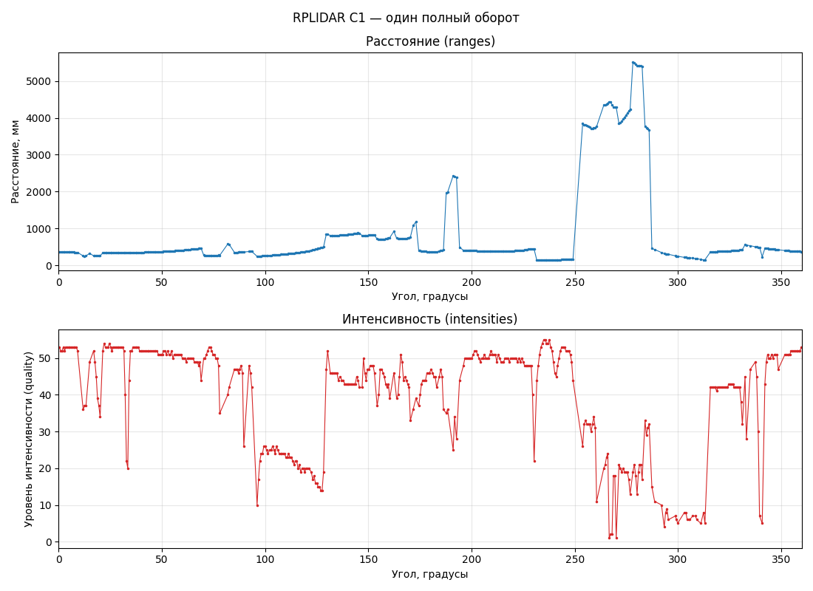
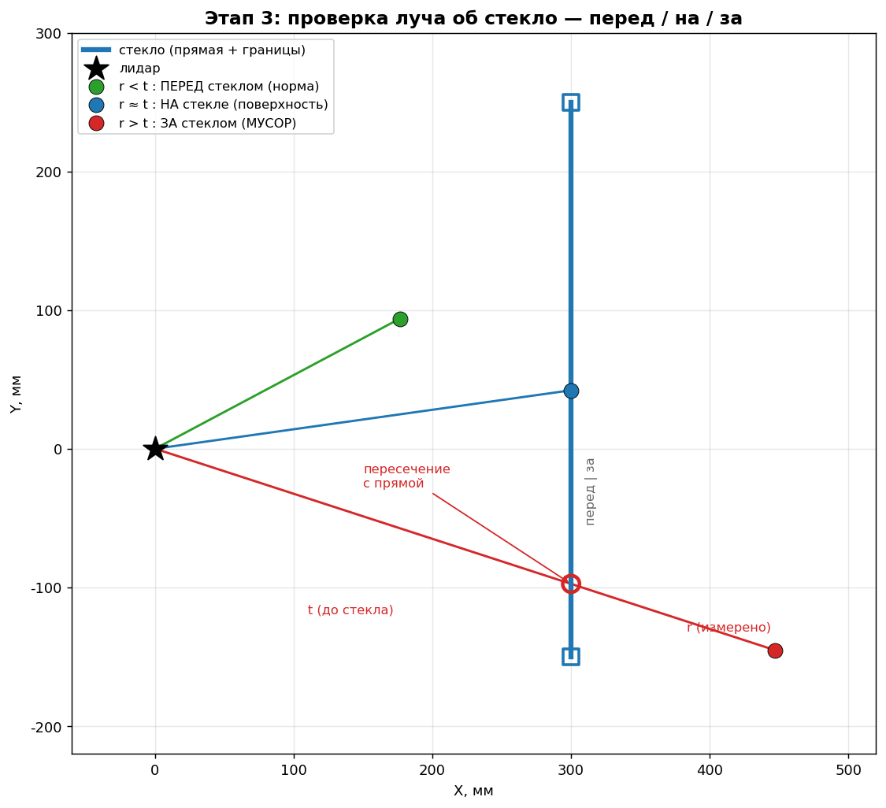
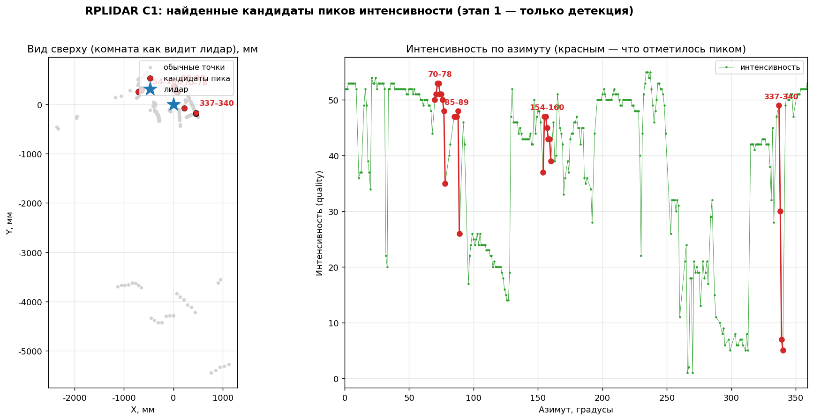
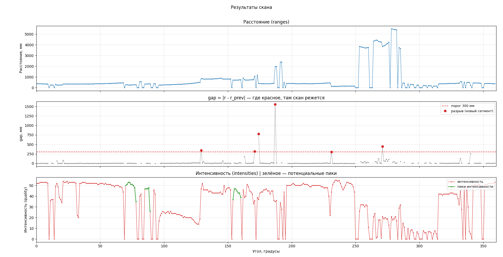
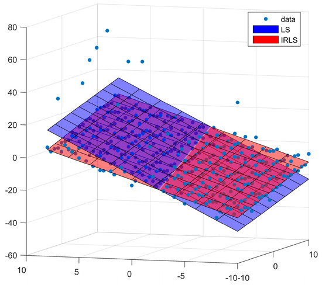
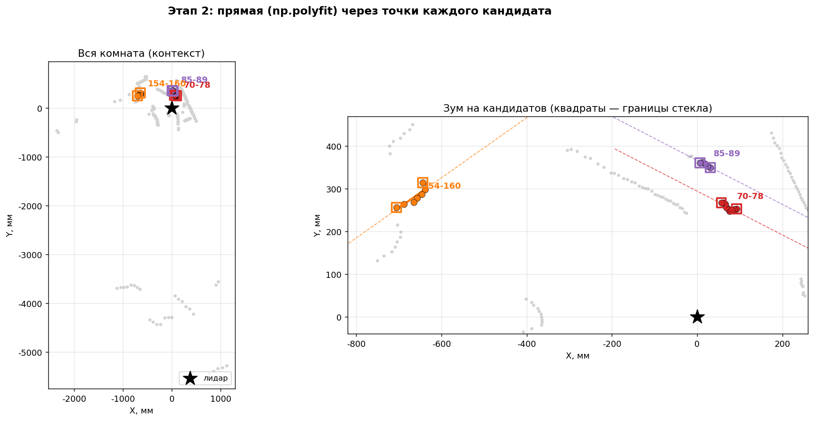
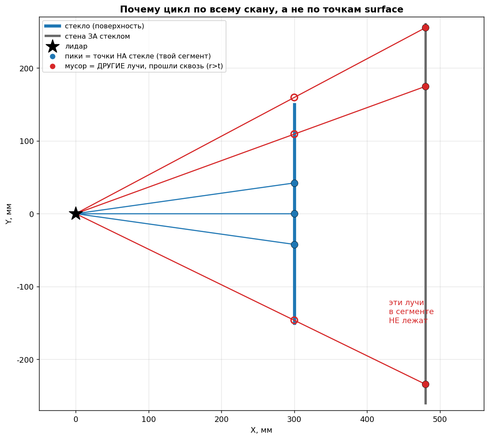
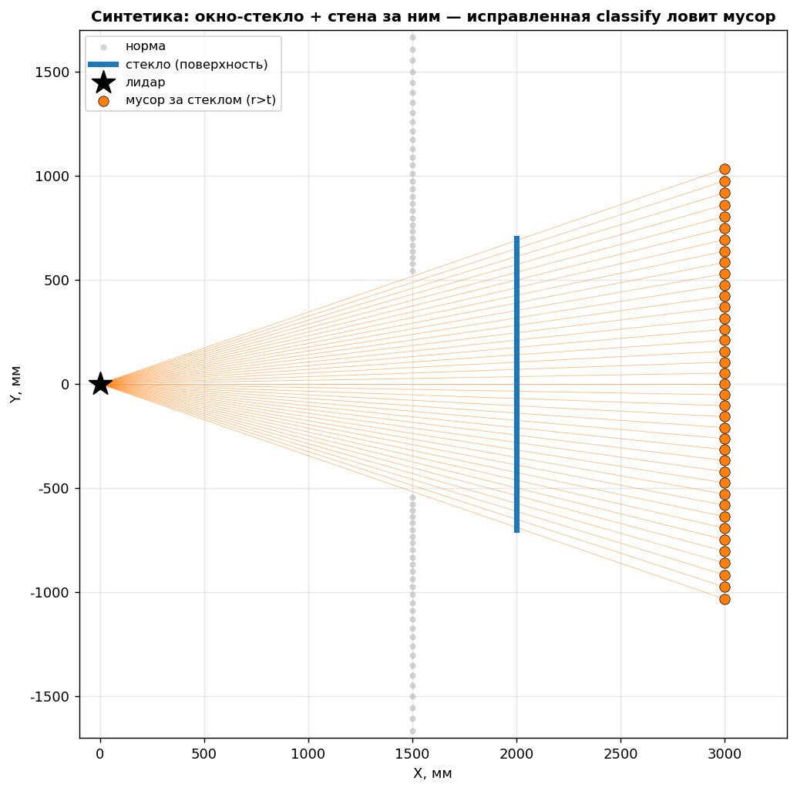
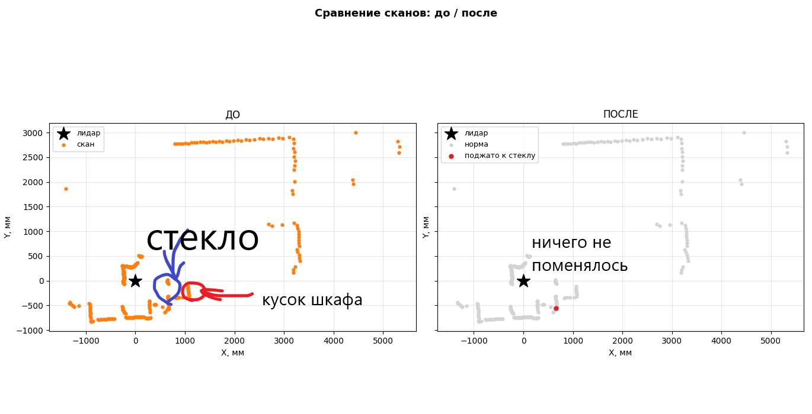
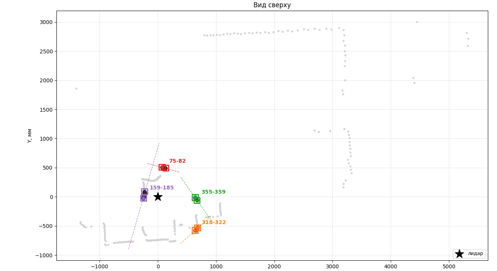

# Фильтр стекла для 2д лидара

## Использование статьи

Я использовал в этом проекте статью от ncbi nih:

```bibtex
@article{li2024detection,
  title={Detection and utilization of reflections in LiDAR scans through plane optimization and plane SLAM},
  author={Li, Yinjie and Zhao, Xiting and Schwertfeger, S{\"o}ren},
  journal={Sensors},
  volume={24},
  number={15},
  pages={4794},
  year={2024},
  publisher={MDPI}
}
```


Статья: «Detection and Utilization of Reflections in LiDAR Scans through Plane
Optimization and Plane SLAM».
Ссылка: https://pmc.ncbi.nlm.nih.gov/articles/PMC11314935/

Все визуализации мне помог сделать clauede и gemini.  

Здесь: 
(0) объяснение алгоритма (очень тяжело для понимания)
(1) карта «функция - раздел статьи» для комментариев в коде, 
(2) краткое резюме метода,
(3) почему для нашего железа/сцены я ухожу на другой признак.

---

## 0. Объяснение как это все работает

Что есть изначально:
 - RPlidar C1 (2д лидар без dual-return)
 - Полученные с него данные: `scan` и `intensivities`


Типы лучей:
 - Луч не долетел до стекла
 - Луч упал на стекло (пересек его)
 - Луч пересек стекло и отразился о объект


### Как находятся координаты точек:
 - Делаем цикл по скану
 - `xo` равен `x_robot` + cos(`theta_robot` + `theta_i`)
 - `yo` равен `y_robot` + sin(`theta_robot` + `theta_i`)

### Как находятся кандидаты пиков интенсивности:
 - Дропауты (<=0) пропускаются, они создают только лишний мусор.
 - `gap` -э то физический разрыв между точками скана.
 - Если `gap` > `cliff`, то это тот `gap`, который реально представляет собой тот самый разрыв между точками.
 - `Gap`'ами набивается последовательность `sequence`. Это значит что `sequence` хранит в себе точки `Point`, которые находятся в этих `gap`'ах.
 - Далее возвращается массив таких `sequence`'ов, это и есть `gap`'ы.



### Проверка `sequence` на валидность:  
Прикол в том, что `sequence`, которую мы нашли это необязательно настоящая отражающая поверность.  
Объяснение:  
 - форма пика: интенсивность точек в sequence  должна сначала монотонно возрастать, а затем убывать
 - минимальная ширина: т.к. пик интенсивности это практически всегда мусор, то длина последовательности должна быть маленькой
 - амплитуда: разница между максимальной интенсивностью и минимальной должна быть больше заданного порога
 - физическая непрерывность: расстояние между лидаром и точками sequene не должна резко меняться.

### Концепт поверхности в 2д пространстве:  
В статье приводится в качестве поверности слово `plane`. Это значит, что есть отражающая поверхность в виде стекла. Поверность в виде паралеллограмма. В 2д срезе получится так, что эта `plane` превратится в `line` (y=kx+b, ax+by+c=0), то есть линию. В статье проверяют набор точек 3д пространства `PointCloud` на предмет похожести на паралелограмм. То есть они берут `RANSAC` и `PCL` и пытаются `фитить` в облако плоскость. Если это получается, то мы нашли отражающую плоскость. Это выглядит примерно вот так:  

Но у меня ни `dual-return`, ни 3д облака нету, у меня только линия. Вот как это выглядит на практике:  

Поэтому ее надо фитить в наши пики через `np.polyfit` или `PCA` алгоритм. Но в ходе разработки выяснилось, что обычны `np.polyfit` - это вещь, которая работает в кустарных условиях, если поверхность вертикальная (все x одинатковы, y меняются) наклон k улетает в бесконечность. Но такого не бывает. Я сделал свою реализацию `PCA`, она лежит в отдельном файле `PCA.py`. Вот как она работает:  

Если заифтить получилось, то эта настоящая поверхность, если нет, то пропускаем.


### Проверка лучей на мусор и перезапись скана:  
Теперь когда есть найденные отражающие поверхности, надо проверить, что лучи, которые рядом с поверхностью, которые проходят и не проходят, не мусорные.
Функция берет каждый луч и смотрит, как луч идет до поверхности:
1. Точка от луча оказалась перед стеклом?
2. Точка на стекле?
3. Точка за стеклом?
Описание геометрии.
Луч номер `i` - это направление под углом `theta_i`. Точка вида (`t`*cos(`theta_i`); `t`*sin(`theta_i`)), где `t` >= 0 - расстояние вдоль луча (range).
Стекло: Прямая в общей форме `a`x+`b`y+`c`=0. У нее есть границы - отрезок начиная с `p_start` и заканчивая `p_end`.
Пересечение: Надо решить уравнение, подставив точку луча в уравнение прямой. Решать надо относительно `t`:
`t` = -`c` / (`a`*cos(`theta_i`) + `b`*sin(`theta_i`))
Три варианта ответа при решении относительно t:
1. если знаменатель ~= 0, то луч параллелен стеклу и не пересекает его.
2. если `t` <= 0, то пересечение позади лидара, его не вопринимаем.
3. иначе: точка пересечения = (`t`*cos(`theta_i`); `t`*sin(`theta_i`)). Надо проверить, что она лежит между `p_start` и `p_end` (действиельная точка, а не мнимая - точка на воображаемом продолжении прямой).
Если нет - этот луч мимо стекла, не вопринимаем

Если `r` ~= `t`, то луч утолкнулся в само стекло
Если `r` > `t`, то луч прошел за стекло (может быть даже на сквозь), лиюо отразился. Это и есть мусор, который надо будет замять.
Если `r` < `t`, то точка перед стеклом, обычное, препятствие. Точка в норме, не вопринимаем

Вот мы нашли все лучи за стеклом, из надо перезаписать. Перезапись выглядит так:
```python
new_scan[i] = `t`, где, `t` - это вектор реальной длины луча до стекла.
```
И получается новы скан. Но как я и говорил, этот фильтр работает только в кустарных условиях, и вот как это выглядит:  




## 1. Карта: функция кода ↔ раздел статьи (для комментариев)

| Функция / кусок кода            | Раздел статьи | Что делает                                                        |
|---------------------------------|---------------|-------------------------------------------------------------------|
| `scan_to_points`                | разд. 3       | перевод (дальность, угол) → (x, y); модель сенсора                 |
| сегментация по `gap` (0.3 м)    | разд. 5.1.2   | порог расстояния между соседними точками = 0.3 м, режет на куски   |
| `find_peaks` / `find_potential_peaks` | разд. 5.1.2, Algorithm 1 | поиск пика интенсивности «вверх до макс, потом вниз» |
| `is_seq_is_valid`               | разд. 5.1.2   | критерии валидности пика: форма, ширина, амплитуда, непрерывность  |
| `fitting` (np.polyfit → прямая) | разд. 5.1.2 / 5.2 | подгонка плоскости (у нас 2D → прямая); в статье RANSAC через PCL |
| `find_real_trash` (луч × прямая)| разд. 5.3     | классификация точек: пересечение луча с плоскостью, сторона        |
| `patch_glass` (перезапись скана)| разд. 5.3     | оставить точки на поверхности, убрать отражения и точки-за-стеклом  |
| (не реализовано) мультискан     | разд. 6       | накопление плоскостей по многим сканам, Plane SLAM, оптимизация    |

Примечание: `dual return` (разд. 5.1.3) мы вообще не трогали — RPLIDAR C1 его не даёт.

---

## 2. Резюме метода (своими словами)

**Задача.** Найти в LiDAR-скане отражающие поверхности (стекло, зеркала) и
почистить искажения, которые они вносят: ложные точки-отражения и точки,
видимые сквозь стекло.

**Два уровня.**
- Однокадровый фронт-энд: детекция отражающей поверхности в одном скане.
- Главный вклад статьи: построение глобальной карты отражающих плоскостей по
  многим сканам (Plane SLAM), с оптимизацией параметров плоскостей.

**Как детектят поверхность в одном скане (разд. 5.1):**
1. *Intensity Peak (5.1.2, Algorithm 1).* Стекло/зеркало под перпендикулярным
   лучом даёт всплеск интенсивности: значение растёт до максимума, затем падает.
   Критерии: соседние точки не дальше 0.3 м друг от друга (иначе последовательность
   рвётся); интенсивность в полосе примерно от 30 до 70 (шкала их сенсора, PCL);
   для 3D-лидара — доп. проверка по кольцам сверху и снизу, что там тоже
   «рост-спад». К найденным точкам RANSAC-ом подгоняют плоскость, сохраняют
   инлайеры и параметры.
2. *Dual Return (5.1.3).* Многоэховый лидар возвращает несколько откликов на луч;
   стекло выдаёт себя по разнице «первый возврат vs самый сильный».

**Классификация (5.3).** Имея уравнение плоскости и её границы, для каждой точки
скана считают: пересекает ли её луч (от сенсора) плоскость в пределах границ, и
на каком расстоянии до плоскости лежит точка. Отсюда 4 класса: обычная точка,
точка на поверхности, точка-отражение, точка за стеклом. Оставляют только точки
на поверхности; отражения и «сквозные» удаляют.

**Мультискан (разд. 6).** Наблюдения плоскости из разных сканов накапливают,
параметры плоскости оптимизируют, границы уточняют. Именно это, а не одиночный
скан, даёт устойчивость — авторы прямо отмечают, что многокадровая карта точнее
однокадрового подхода.

**Ключевые числа (их сенсор):** порог разрыва дальности 0.3 м; полоса интенсивности
пика ≈ 30…70; фит плоскости — RANSAC.

---

## 3. Почему я ухожу от этого метода (для моего случая)

Метод правильный, но заточен под то, чего у меня нет.

1. **Нет dual-return и вертикальных колец.** RPLIDAR C1 — одно кольцо, один
   возврат. Значит, недоступны и dual-return (5.1.3), и кросс-кольцевая проверка
   пика из Algorithm 1. Половина устойчивости метода отваливается сразу.

2. **Пик интенсивности — слабый сигнал на C1.** «Quality» гуляет в районе ~50 с
   шумом ±3–5. Мой детектор с мягким порогом ловил мелкие яркие бугорки (ложные
   срабатывания) и не находил стекло.

3. **Мои стёкла дают ДРУГОЙ признак.** Они стоят под углом, за ними объекты.
   Такой стекло не «вспыхивает» (нет перпендикулярного specular-пика), а
   пропускает луч насквозь → сигнал это **скачок дальности вверх + провал
   интенсивности вниз + дропауты**. Пик-детектор на это не смотрит в принципе,
   поэтому реальные стёкла пропускает.

4. **Устойчивость метода — в мультискане.** Я работаю по одному кадру. Одиночный
   скан у авторов — заведомо более слабый режим.

**Вывод:** intensity-peak метод — правильный инструмент для **зеркал и стекла в
упор** (перпендикулярная вспышка). Для **стекла под углом с объектами за ним** нужен
признак «сквозняка», а его лучше берёт Tibebu et al. 2021 (MDPI Sensors,
«LiDAR-Based Glass Detection…», https://www.mdpi.com/1424-8220/21/7/2263):
детекция по разрыву дальности + совместному изменению дальности и интенсивности,
без опоры на пик. Это работает на одном 2D-скане.

---

## 4. Что переносится на новую ветку

Меняется только критерий детекции (этап 1). Геометрическая инфраструктура —
переиспользуется:
- сегментация скана;
- fit прямой к точкам поверхности;
- classify (пересечение луча с прямой, сторона);
- patch (поджатие к плоскости).

Отдельно: для «сквозного» стекла детекция сразу отдаёт и мусорные лучи, и ближний
фон, к которому их поджимать, поэтому этапы fit+classify для него могут схлопнуться
в простое «поджать сегмент к дистанции рамы». Пик-детектор оставляем как отдельный
путь для зеркал.
